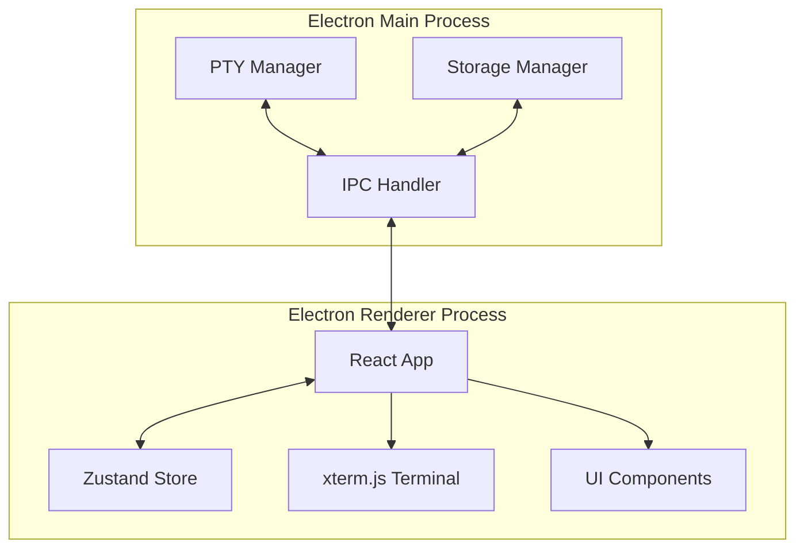

# Client Manager 技术架构文档

## 1. 架构设计



## 2. 技术描述

- **前端**: React@18 + TailwindCSS@3 + Vite
- **桌面框架**: Electron@29
- **初始化工具**: create-electron-vite
- **终端**: xterm.js + node-pty
- **状态管理**: Zustand
- **数据持久化**: electron-store

## 3. 目录结构

```
cli_manager/
├── src/
│   ├── main/              # Electron主进程
│   │   ├── index.ts       # 主进程入口
│   │   ├── pty.ts         # PTY管理
│   │   └── storage.ts     # 持久化存储
│   ├── renderer/          # Electron渲染进程
│   │   ├── src/
│   │   │   ├── App.tsx
│   │   │   ├── main.tsx
│   │   │   ├── store/     # Zustand状态管理
│   │   │   ├── components/# UI组件
│   │   │   ├── hooks/     # 自定义hooks
│   │   │   └── utils/     # 工具函数
│   │   └── index.html
│   └── preload/           # 预加载脚本
├── package.json
└── vite.config.ts
```

## 4. 数据模型

### 4.1 数据模型定义

```mermaid
erDiagram
    SESSION ||--o{ GROUP : belongs to
    SESSION {
        string id
        string name
        string groupId
        string terminalType
        string cwd
        string[] history
        string status
        number createdAt
        number lastActivityAt
    }
    GROUP {
        string id
        string name
        string color
        number order
    }
    PRESET {
        string id
        string name
        string terminalType
        string cwd
        string initialCommand
    }
    SNAPSHOT {
        string id
        string name
        SnapshotData data
        number createdAt
    }
```

### 4.2 TypeScript 类型定义

```typescript
// 会话状态
export type SessionStatus = 'idle' | 'needs-input' | 'needs-confirm' | 'error' | 'running';

// 会话
export interface Session {
  id: string;
  name: string;
  groupId?: string;
  terminalType: 'powershell' | 'cmd' | 'bash';
  cwd: string;
  history: string[];
  status: SessionStatus;
  createdAt: number;
  lastActivityAt: number;
}

// 分组
export interface Group {
  id: string;
  name: string;
  color: string;
  order: number;
}

// 预设
export interface Preset {
  id: string;
  name: string;
  terminalType: 'powershell' | 'cmd' | 'bash';
  cwd: string;
  initialCommand?: string;
}

// 快照
export interface Snapshot {
  id: string;
  name: string;
  data: SnapshotData;
  createdAt: number;
}

export interface SnapshotData {
  sessions: Array<{
    name: string;
    groupId?: string;
    terminalType: string;
    cwd: string;
    history: string[];
  }>;
  groups: Group[];
}
```

## 5. IPC 通信定义

### 5.1 主进程 -> 渲染进程

```typescript
// 会话输出
ipcMain.on('session-output', (event, sessionId: string, data: string) => {});

// 会话退出
ipcMain.on('session-exit', (event, sessionId: string, exitCode: number) => {});
```

### 5.2 渲染进程 -> 主进程

```typescript
// 创建会话
ipcRenderer.invoke('create-session', config: CreateSessionConfig): Promise<string>;

// 发送输入
ipcRenderer.invoke('send-input', sessionId: string, data: string): Promise<void>;

// 关闭会话
ipcRenderer.invoke('close-session', sessionId: string): Promise<void>;

// 调整大小
ipcRenderer.invoke('resize-session', sessionId: string, cols: number, rows: number): Promise<void>;

// 存储操作
ipcRenderer.invoke('storage-get', key: string): Promise<any>;
ipcRenderer.invoke('storage-set', key: string, value: any): Promise<void>;
```
