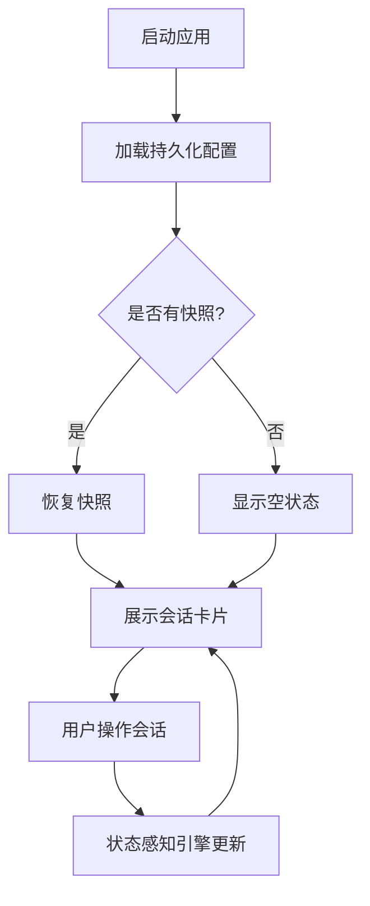

# Client Manager 产品需求文档 (PRD)

## 1. 产品概述

Client Manager 是一个面向开发者的多终端会话管理桌面应用，专为统一管理 AI Client（如 Clock Code、Codex 等）而设计。

- 解决开发者同时管理多个终端会话的混乱问题，降低管理成本
- 提供状态感知、快捷操作、快照恢复等能力，提升开发效率

## 2. 核心功能

### 2.1 用户角色
| 角色 | 注册方式 | 核心权限 |
|------|---------|---------|
| 开发者 | 无需注册 | 所有功能完整使用权限 |

### 2.2 功能模块
1. **主界面**: 会话卡片展示、左侧分组边栏、顶部工具栏
2. **全屏终端**: 基于 xterm.js 的完整终端视图
3. **预设管理**: 预设模板创建与管理
4. **快照管理**: 工作环境快照保存与恢复

### 2.3 页面详情
| 页面名称 | 模块名称 | 功能描述 |
|---------|---------|---------|
| 主界面 | 会话卡片 | 以卡片形式展示PTY终端会话，包含预览、状态标签、快捷操作 |
| 主界面 | 左侧分组边栏 | 自定义分组管理、颜色标记、筛选 |
| 主界面 | 顶部工具栏 | 搜索框、新建会话、快照控制、设置 |
| 全屏终端 | 终端视图 | xterm.js渲染的完整终端，支持快捷键操作 |
| 预设管理 | 预设列表 | 查看、编辑、删除预设模板 |
| 快照管理 | 快照列表 | 查看、恢复、删除工作环境快照 |

## 3. 核心流程

### 3.1 新建会话流程
用户点击新建会话 → 选择预设或自定义配置 → 创建PTY进程 → 渲染会话卡片 → 实时显示输出

### 3.2 快照恢复流程
用户点击快照列表 → 选择快照 → 关闭当前会话 → 按快照配置重建会话 → 恢复布局与状态

## 4. 用户界面设计

### 4.1 设计风格
- **主色调**: 深蓝色 #1e40af，辅助色：青色 #06b6d4
- **按钮风格**: 圆角矩形，hover效果轻微上浮
- **字体**: Inter，字号系统（12/14/16/20px）
- **布局风格**: 卡片式布局，左侧边栏导航
- **主题**: 支持Dark/Light模式切换
- **图标**: 使用Lucide React图标库，简洁线性风格

### 4.2 页面设计概览
| 页面名称 | 模块名称 | UI元素 |
|---------|---------|--------|
| 主界面 | 会话卡片 | 卡片背景浅灰，状态标签彩色边框，底部快捷按钮栏 |
| 主界面 | 左侧分组边栏 | 可折叠分组，颜色圆点标记，拖拽排序 |
| 主界面 | 顶部工具栏 | 搜索框圆角，按钮紧凑排列 |
| 全屏终端 | 终端视图 | 黑色背景，绿色光标，经典终端配色 |

### 4.3 响应性
- 桌面优先设计，支持窗口缩放
- 终端区域自适应窗口大小
- 卡片网格布局随窗口宽度自动调整列数

## 5. 技术栈选型（已补充）

### 5.1 前端框架
- 桌面应用框架：**Electron**
- UI框架：**React 18**
- 构建工具：**Vite**
- 终端渲染：**xterm.js** + **node-pty**
- UI组件库：**TailwindCSS** + **shadcn/ui**
- 状态管理：**Zustand**
- 主题支持：Dark/Light模式

### 5.2 核心依赖
- `electron`: ^29.0.0
- `react`: ^18.2.0
- `xterm`: ^5.3.0
- `node-pty`: ^1.0.0
- `zustand`: ^4.5.0
- `lucide-react`: ^0.340.0
